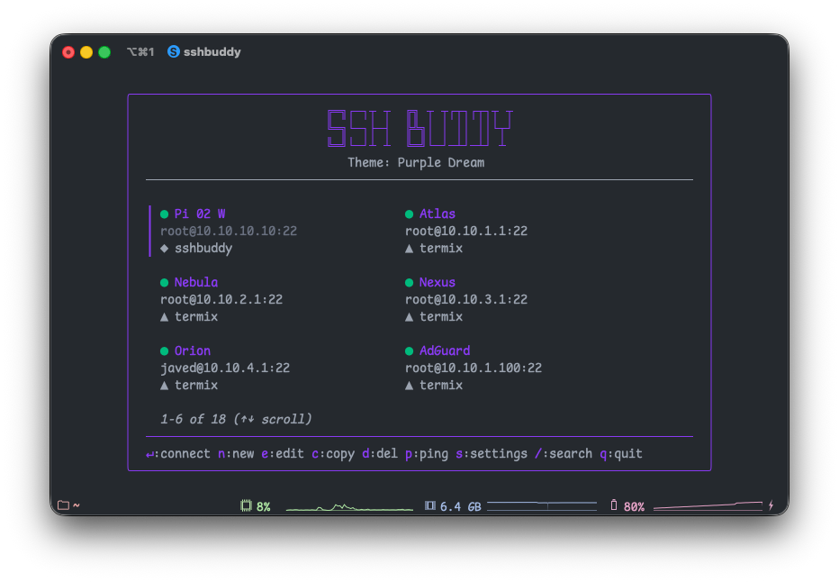
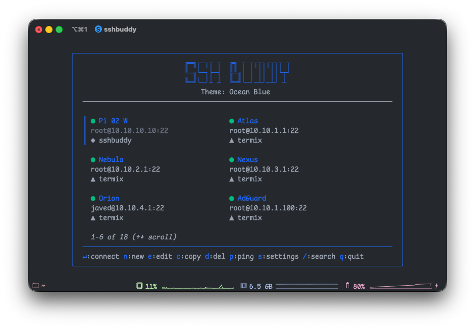
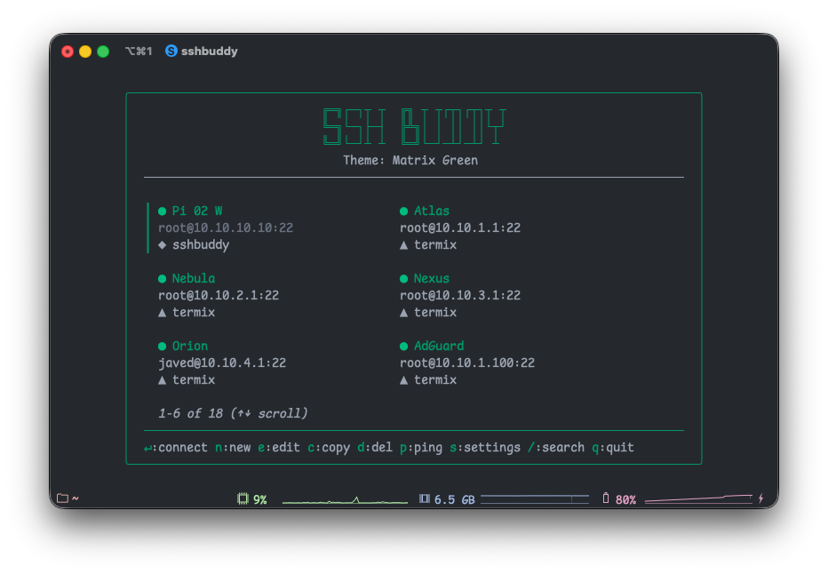
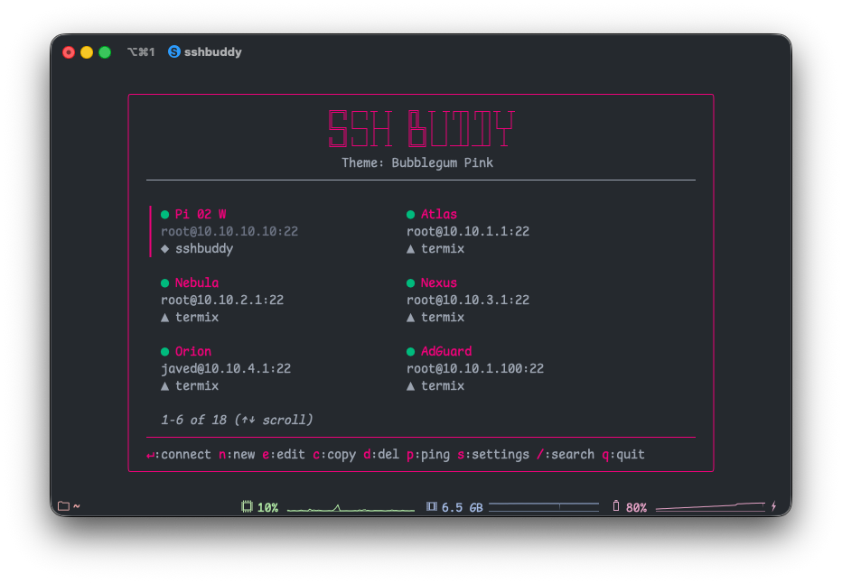
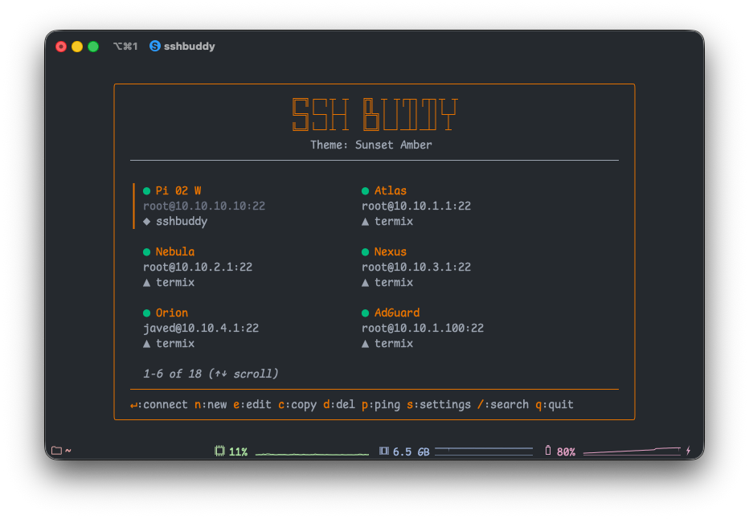

<pre>
╔═╗┌─┐┬ ┬  ╔╗ ┬ ┬┌┬┐┌┬┐┬ ┬
╚═╗└─┐├─┤  ╠╩╗│ │ ││ ││└┬┘
╚═╝└─┘┴ ┴  ╚═╝└─┘─┴┘─┴┘ ┴
</pre>

A modern terminal interface for managing SSH connections. SSHBuddy brings together hosts from multiple sources—your manual entries, SSH config, and [Termix](https://github.com/Termix-SSH/Termix) API—into one unified, keyboard-driven interface.



**Key Features**: Live ping status • Multiple data sources • Six color themes • Intuitive two-column layout • Keyboard-first navigation

## Installation

### Homebrew (macOS/Linux)

```bash
brew tap javedh-dev/tap
brew install sshbuddy
```

### From Source

Requires Go 1.24 or later:

```bash
git clone https://github.com/javedh-dev/sshbuddy.git
cd sshbuddy
go build -o sshbuddy ./cmd/sshbuddy
sudo mv sshbuddy /usr/local/bin/
```

### Download Binary

Pre-built binaries for Linux, macOS, and Windows are available on the [releases page](https://github.com/javedh-dev/sshbuddy/releases).

## Quick Start

### Interactive TUI

Launch SSHBuddy from your terminal:

```bash
sshbuddy
```

**Add your first host**: Press `n`, fill in the connection details, and press Enter to save.

**Connect**: Use arrow keys to select a host, then press Enter to establish the SSH connection.

**Search**: Press `/` and start typing to filter hosts by name or hostname.

### Quick Connect (CLI)

Connect directly to a host without the TUI:

```bash
# Connect by alias
sshbuddy connect Atlas
sshbuddy c Atlas  # Short form

# List all hosts
sshbuddy list
sshbuddy ls  # Short form
```

### Shell Autocomplete

Enable tab completion for commands and host aliases:

```bash
# Automatic installation (detects your shell)
sshbuddy completion install

# Or manually for specific shells
source <(sshbuddy completion bash)  # Bash
source <(sshbuddy completion zsh)   # Zsh
sshbuddy completion fish | source   # Fish
```

For detailed instructions, see the [Getting Started Guide](docs/getting-started.md) and [CLI Usage](docs/cli-usage.md).

## Features

### Connection Management
- **Multiple data sources**: Combine manual hosts, SSH config entries, and Termix API hosts in one interface
- **Live status indicators**: Real-time ping status shows which hosts are reachable
- **Smart organization**: Tag hosts and use visual icons to identify their source
- **Quick duplication**: Copy existing hosts to speed up adding similar configurations

### User Experience
- **Keyboard-first design**: Every action is accessible via keyboard shortcuts
- **Two-column layout**: See more hosts at once with an efficient grid display
- **Instant search**: Filter hundreds of hosts in milliseconds
- **Six color themes**: Choose a theme that matches your terminal aesthetic

### SSH Features
- **Full SSH config support**: Reads your existing `~/.ssh/config` automatically
- **Advanced authentication**: SSH keys, ProxyJump, custom ports, and more
- **Seamless execution**: Connects using your system's SSH client with all parameters

### Integration
- **Termix API support**: Fetch hosts from your Termix server with secure token-based auth
- **Unified configuration**: Everything stored in one JSON file for easy backup and sync
- **Cross-platform**: Works on Linux, macOS, and Windows

## Keyboard Shortcuts

### Main Actions
- `Enter` - Connect to selected host
- `n` - Add new host
- `e` - Edit host (manual hosts only)
- `c` - Duplicate host
- `d` - Delete host (manual hosts only)

### Navigation
- `↑`/`↓` or `k`/`j` - Move between rows
- `←`/`→` or `h`/`l` - Move between columns
- `/` - Search and filter hosts

### Utilities
- `p` - Ping all hosts to check status
- `s` - Open settings menu
- `q` - Quit application

For a complete reference, see [Keyboard Shortcuts](docs/keyboard-shortcuts.md).

## Themes

SSHBuddy includes six professionally designed themes. Access them through the settings menu (press `s`, navigate to Theme, and press Space/Enter to cycle).

<table>
<tr>
<td width="50%">

**Purple Dream** (Default)


</td>
<td width="50%">

**Ocean Blue**


</td>
</tr>
<tr>
<td width="50%">

**Matrix Green**


</td>
<td width="50%">

**Bubblegum Pink**


</td>
</tr>
<tr>
<td width="50%">

**Sunset Amber**


</td>
<td width="50%">

**Cyber Cyan**


</td>
</tr>
</table>

Learn more about themes in the [Themes Guide](docs/themes.md).

## Configuration

SSHBuddy stores everything in `~/.config/sshbuddy/config.json`. Press `s` to access settings where you can:
- Toggle data sources (Manual, SSH Config, Termix)
- Change themes
- Configure Termix API
- Set custom SSH config path

### Data Sources

- **Manual Hosts (◆)** - Hosts you add through SSHBuddy
- **SSH Config (■)** - Automatically imported from `~/.ssh/config`
- **Termix API (▲)** - Fetched from your Termix server

See the [Configuration Guide](docs/configuration.md) and [Data Sources](docs/data-sources.md) for details.

## Documentation

- [Getting Started](docs/getting-started.md) - Installation and first steps
- [CLI Usage](docs/cli-usage.md) - Command-line interface and autocomplete
- [Configuration](docs/configuration.md) - Detailed configuration options
- [Data Sources](docs/data-sources.md) - Working with multiple host sources
- [Keyboard Shortcuts](docs/keyboard-shortcuts.md) - Complete shortcut reference
- [Themes](docs/themes.md) - Theme customization guide
- [Troubleshooting](docs/troubleshooting.md) - Common issues and solutions

## Contributing

Contributions are welcome! Feel free to open issues for bugs or feature requests, or submit pull requests.

## License

MIT License - see [LICENSE](LICENSE) for details.

---

Built with [Bubble Tea](https://github.com/charmbracelet/bubbletea) and [Lipgloss](https://github.com/charmbracelet/lipgloss)
