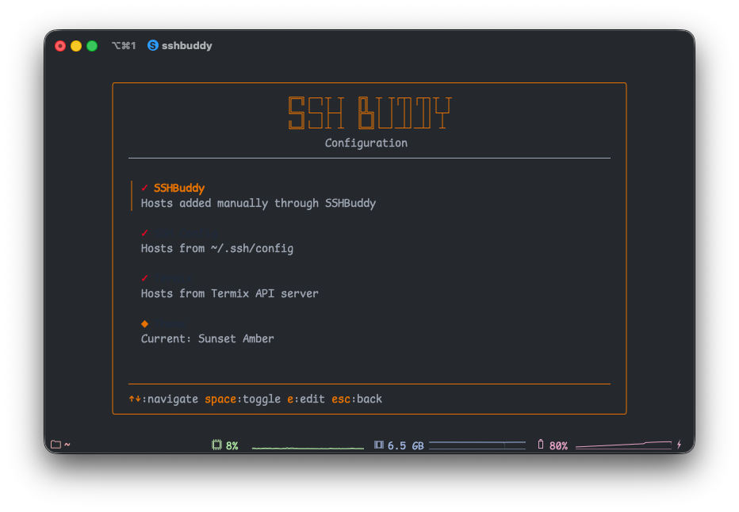

# Configuration

SSHBuddy stores all configuration in a single JSON file located at `~/.config/sshbuddy/config.json`. This unified approach makes it easy to back up, version control, or sync your settings across machines.

## Configuration File Structure

```json
{
  "hosts": [],
  "theme": "purple",
  "sources": {
    "sshbuddyEnabled": true,
    "sshConfigEnabled": true,
    "termixEnabled": false
  },
  "termix": {
    "enabled": false,
    "baseUrl": "",
    "jwt": "",
    "jwtExpiry": 0
  },
  "ssh": {
    "enabled": true,
    "configPath": ""
  }
}
```

## Settings Overview

### Hosts

The `hosts` array contains all manually added SSH connections. Each host includes:

- `alias`: Display name
- `hostname`: Server address
- `user`: SSH username
- `port`: SSH port (default: "22")
- `tags`: Array of organizational tags
- `identity_file`: Path to SSH private key
- `proxy_jump`: Bastion host for jump connections
- `source`: Always "manual" for manually added hosts

### Theme

Choose from six color schemes to match your terminal aesthetic:

- `purple` - Purple Dream (default)
- `blue` - Ocean Blue
- `green` - Matrix Green
- `pink` - Bubblegum Pink
- `amber` - Sunset Amber
- `cyan` - Cyber Cyan

Change themes through the settings menu (press `s`, navigate to Theme, and press Space/Enter to cycle).

### Data Sources

Control which sources SSHBuddy uses to populate your host list:

- **sshbuddyEnabled**: Show manually added hosts
- **sshConfigEnabled**: Import hosts from SSH config file
- **termixEnabled**: Fetch hosts from Termix API

### Termix Configuration

When Termix integration is enabled:

- **enabled**: Master switch for Termix integration
- **baseUrl**: Your Termix API endpoint
- **jwt**: Cached authentication token (managed automatically)
- **jwtExpiry**: Token expiration timestamp (managed automatically)

Credentials are never stored. When the token expires, SSHBuddy prompts you to re-authenticate.

### SSH Configuration

- **enabled**: Whether to read from SSH config
- **configPath**: Custom path to SSH config file (leave empty for default `~/.ssh/config`)

## Accessing Settings

Press `s` from the main screen to open the settings interface. Here you can:

- Toggle data sources on/off
- Change the color theme
- Edit Termix API settings
- Configure SSH config path



## Manual Configuration

While SSHBuddy provides a UI for most settings, you can also edit the config file directly. Just ensure the JSON is valid, and SSHBuddy will validate it on next launch.

## Configuration Location

The config file respects the `XDG_CONFIG_HOME` environment variable. If set, SSHBuddy uses `$XDG_CONFIG_HOME/sshbuddy/config.json`. Otherwise, it defaults to `~/.config/sshbuddy/config.json`.

## Authentication Types

SSHBuddy supports multiple SSH authentication methods:

### Password Authentication

The default SSH behavior. When you connect to a host without specifying an identity file, SSH will prompt for a password if needed.

### Key-Based Authentication

Specify the path to your SSH private key in the "Identity File" field when adding or editing a host.

**Example**: `~/.ssh/id_rsa` or `~/.ssh/production_key`

**Requirements**:
- The key file must exist and be readable
- Proper permissions: `chmod 600 ~/.ssh/id_rsa`
- Public key must be in the server's `~/.ssh/authorized_keys`

### ProxyJump (Bastion Hosts)

Connect through an intermediate jump host. Useful when your target server is only accessible through a bastion host.

**Example**: `bastion.example.com`

**How it works**: SSHBuddy passes this to SSH as `-J bastion.example.com`, which establishes a connection through the bastion to reach your target host.

**Requirements**:
- You must have access to the bastion host
- The bastion must have access to the target host
- Your SSH client must support ProxyJump (OpenSSH 7.3+)

### Custom Ports

Specify a non-standard SSH port in the "Port" field. Leave empty to use the default port 22.

**Example**: `2222` for a server running SSH on a custom port

## Example Configuration

Here's a complete config file showing various authentication methods:

```json
{
  "hosts": [
    {
      "alias": "Production Server",
      "hostname": "prod.example.com",
      "user": "admin",
      "port": "22",
      "tags": ["production", "web"],
      "identity_file": "~/.ssh/prod_key",
      "proxy_jump": "bastion.example.com"
    },
    {
      "alias": "Dev Server",
      "hostname": "192.168.1.100",
      "user": "developer",
      "port": "2222",
      "tags": ["development"]
    },
    {
      "alias": "Database Server",
      "hostname": "db.internal",
      "user": "dbadmin",
      "port": "22",
      "tags": ["database", "production"],
      "identity_file": "~/.ssh/db_key",
      "proxy_jump": "bastion.example.com"
    }
  ],
  "theme": "purple",
  "sources": {
    "sshbuddyEnabled": true,
    "sshConfigEnabled": true,
    "termixEnabled": false
  },
  "termix": {
    "enabled": false,
    "baseUrl": "https://your-termix-server.com/api",
    "jwt": "",
    "jwtExpiry": 0
  },
  "ssh": {
    "enabled": true,
    "configPath": ""
  }
}
```

## Backup and Sync

Since everything lives in one file, backing up your configuration is straightforward:

```bash
# Backup
cp ~/.config/sshbuddy/config.json ~/sshbuddy-backup.json

# Restore
cp ~/sshbuddy-backup.json ~/.config/sshbuddy/config.json
```

For syncing across machines, consider using a dotfiles repository or cloud storage service.
