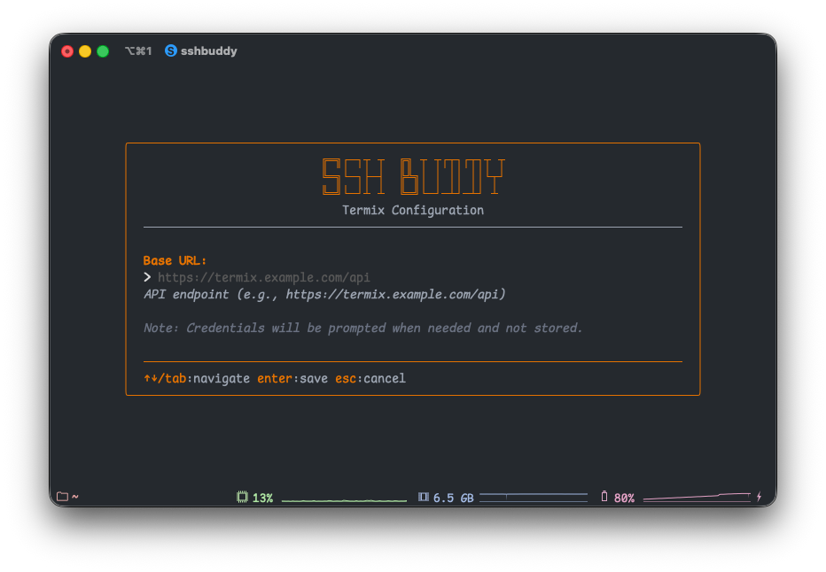

# Data Sources

SSHBuddy can pull host information from multiple sources, giving you a unified view of all your SSH connections regardless of where they're defined.

## Manual Hosts (SSHBuddy)

These are hosts you add directly through SSHBuddy's interface. They're stored in the config file and marked with a diamond icon (◆).

**Adding a host**: Press `n` from the main screen and fill in the details.

**Editing**: Select a host and press `e` to modify its settings.

**Duplicating**: Press `c` on any host to create a copy with "(copy)" appended to the name.

**Deleting**: Press `d` and confirm to remove a host.

## SSH Config

SSHBuddy can read your existing `~/.ssh/config` file and display those hosts alongside your manual entries. These hosts are marked with a square icon (■).

### Enabling SSH Config Integration

1. Press `s` to open settings
2. Ensure "SSH Config" is enabled (green checkmark)
3. Optionally press `e` on SSH Config to specify a custom config file path

### Supported SSH Config Features

SSHBuddy recognizes these SSH config directives:

- `Host` - Used as the alias
- `HostName` - Server address
- `User` - SSH username
- `Port` - Connection port
- `IdentityFile` - SSH key path
- `ProxyJump` - Bastion host

### Read-Only Nature

Hosts from SSH config are read-only in SSHBuddy. To modify them, edit your `~/.ssh/config` file directly. SSHBuddy will reflect the changes on next launch.

### Conflict Resolution

If a host alias exists in both manual hosts and SSH config, the manual host takes precedence. This allows you to override SSH config entries when needed.

## Termix API

Termix is a web-based SSH connection manager. SSHBuddy can fetch your Termix hosts and display them in the interface, marked with a triangle icon (▲).

### Setting Up Termix Integration

1. Press `s` to open settings
2. Navigate to "Termix" and press `e` to edit
3. Enter your Termix API base URL (e.g., `https://termix.example.com/api`)
4. Press Enter to save
5. Toggle Termix on by pressing Space/Enter on the Termix option



### Authentication Flow

Termix uses a secure, credential-free authentication approach:

1. **First Connection**: When you enable Termix, SSHBuddy prompts for your username and password
2. **Token Storage**: After successful authentication, only the JWT token and its expiry are saved
3. **Automatic Re-auth**: When the token expires, you're prompted to log in again
4. **No Credential Storage**: Your username and password are never written to disk

### API Requirements

Your Termix server must provide these endpoints:

- `POST /users/login` - Authentication (returns JWT as cookie)
- `GET /ssh/db/host` - Host list retrieval

### Default Path Support

SSHBuddy automatically imports the `defaultPath` field from Termix hosts. When you connect to a Termix host that has a default path configured, SSHBuddy will automatically navigate to that directory after establishing the connection.

This seamless integration means your workflow preferences from Termix are preserved in SSHBuddy without any additional configuration.

### Importing Termix Hosts to Local

You can import hosts from Termix into your local manual configuration using the CLI:

```bash
# Import all Termix hosts as manual hosts
sshbuddy import termix

# Import and overwrite existing hosts with the same alias
sshbuddy import termix --overwrite
```

**Why import?**
- **Offline access**: Work with Termix hosts even when the API is unavailable
- **Customization**: Edit imported hosts locally without affecting Termix
- **Migration**: Gradually move from Termix to SSHBuddy
- **Backup**: Keep a local copy of your Termix hosts

**How it works:**
1. Fetches all hosts from your configured Termix API
2. Converts them to manual hosts (changing source from "termix" to "manual")
3. Preserves all host details including default path, tags, and connection info
4. Skips hosts that already exist locally (unless `--overwrite` is used)
5. Saves the imported hosts to your config file

For more details, see the [CLI Usage Guide](cli-usage.md#import-from-termix).

### Conflict Resolution

Like SSH config, if a Termix host has the same alias as a manual or SSH config host, the local host takes precedence. This ensures your manual overrides are always respected.

## Source Priority

When multiple sources define hosts with the same alias, SSHBuddy uses a priority system to determine which configuration "wins":

1. **Termix hosts** (highest priority)
2. **SSH Config hosts**
3. **Manual hosts** (lowest priority)

This hierarchy ensures that your Termix (cloud) configuration takes precedence, with local SSH config as a fallback, and manual entries as the final option.

**Multiple Source Display:**

SSHBuddy now shows ALL sources where a host is available. For example, if you have a host named "production" defined in all three sources, you'll see:

- Primary source indicated by the source name (e.g. "termix")
- All source icons displayed together (e.g., ▲■◆)
- A "+2" indicator showing it's available in 2 additional sources

This transparency helps you understand where each host is configured and manage potential conflicts.

**Example:**
- `▲■◆ termix +2` - Host defined in Termix (active), also available in SSH Config and Manual
- `▲■ termix +1` - Host defined in Termix (active), also available in SSH Config
- `◆ sshbuddy` - Host only defined in manual configuration

## Disabling Sources

You can disable any source through the settings menu:

1. Press `s` to open settings
2. Navigate to the source you want to disable
3. Press Space or Enter to toggle it off

Disabled sources won't be queried, and their hosts won't appear in the list. This is useful if you want to temporarily focus on a specific set of hosts or if a source is unavailable.

## Visual Indicators

Each host displays an icon indicating its source:

- ◆ Manual (SSHBuddy)
- ■ SSH Config
- ▲ Termix

These icons help you quickly identify where each host comes from, especially useful when managing hosts from multiple sources.
