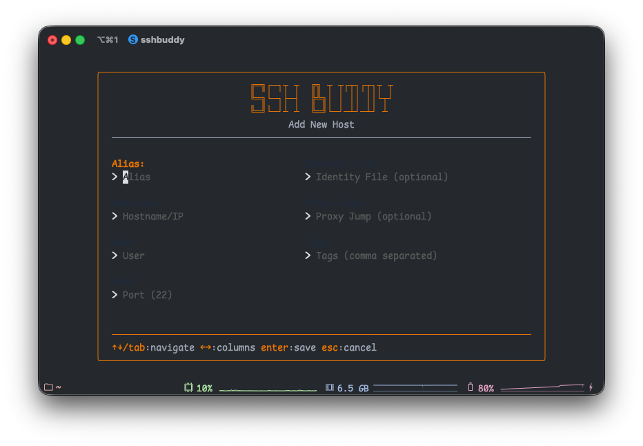

# Getting Started with SSHBuddy

SSHBuddy is a terminal user interface (TUI) application that simplifies SSH connection management. Whether you're managing a handful of servers or dozens of hosts across different environments, SSHBuddy provides an intuitive interface to organize and connect to your SSH hosts.

## Installation

### Homebrew (macOS/Linux)

The easiest way to install SSHBuddy on macOS or Linux:

```bash
brew tap javedh-dev/tap
brew install sshbuddy
```

### From Source

If you have Go installed (version 1.24 or later):

```bash
git clone https://github.com/javedh-dev/sshbuddy.git
cd sshbuddy
go build -o sshbuddy ./cmd/sshbuddy
sudo mv sshbuddy /usr/local/bin/
```

### Download Binary

Download the latest release for your platform from the [releases page](https://github.com/javedh-dev/sshbuddy/releases).

## First Launch

### Interactive Mode

Simply run `sshbuddy` in your terminal:

```bash
sshbuddy
```

On first launch, you'll see an empty host list. SSHBuddy automatically creates a configuration file at `~/.config/sshbuddy/config.json` where your settings and manually added hosts are stored.

### Command-Line Mode

SSHBuddy also works as a command-line tool for quick connections:

```bash
# Connect directly to a host by alias
sshbuddy connect <alias>
sshbuddy c <alias>  # Short form

# List all configured hosts
sshbuddy list
sshbuddy ls  # Short form

# Enable shell autocomplete (automatic)
sshbuddy completion install

# Or manually for specific shells
source <(sshbuddy completion bash)  # For bash
source <(sshbuddy completion zsh)   # For zsh
sshbuddy completion fish | source   # For fish
```

See the [CLI Usage Guide](cli-usage.md) for more details on command-line features.

## Adding Your First Host

Press `n` to add a new host. You'll see a form with the following fields:

- **Alias**: A friendly name for your host (e.g., "Production Server")
- **Hostname**: The server's IP address or domain name
- **User**: Your SSH username
- **Port**: SSH port (defaults to 22 if left empty)
- **Identity File**: Path to your SSH private key (optional)
- **Proxy Jump**: Bastion host for jump connections (optional)
- **Tags**: Comma-separated tags for organization (optional)



Navigate between fields using Tab or arrow keys. Press Enter when you're done to save the host.

## Connecting to a Host

Use the arrow keys to select a host from the list, then press Enter to connect. SSHBuddy will execute the SSH command with all the appropriate parameters based on your configuration.

## Quick Tips

- Press `/` to search and filter your hosts by name or hostname
- Press `p` to ping all hosts and see which ones are online
- Press `s` to access settings and configure data sources
- Press `c` on any host to quickly duplicate it with a new name

## Tips for Getting Started

### Efficient Navigation

The two-column layout lets you see more hosts at once. Use `↑`/`↓` to move between rows and `←`/`→` to switch columns. This grid layout is designed to maximize screen space while keeping everything readable.

### Quick Search

Press `/` and start typing to instantly filter your hosts. This is the fastest way to find a specific server when you have many hosts. The search filters by both alias and hostname, so you can search however you remember the server.

### Duplicate for Speed

When adding similar hosts, press `c` on an existing host to duplicate it, then modify the copy. This is much faster than filling out the form from scratch, especially when you have multiple servers with similar configurations.

### Check Status at a Glance

Press `p` to ping all hosts and see which ones are online:
- **Green dots** (●) - Host is reachable
- **Red dots** (●) - Host is offline or unreachable
- **Gray circles** (○) - Status unknown (not yet pinged)
- **Yellow dots** (●) - Ping in progress

### Source Indicators

Each host displays an icon showing where it came from:
- **◆** - Manual hosts (added through SSHBuddy)
- **■** - SSH Config hosts (from `~/.ssh/config`)
- **▲** - Termix hosts (from Termix API)

This helps you quickly identify which hosts you can edit (manual only) and where to make changes if needed.

## What's Next?

- Learn about [CLI usage](cli-usage.md) for quick connections and autocomplete
- Learn about [configuration options](configuration.md) to customize SSHBuddy
- Explore [data sources](data-sources.md) to import hosts from SSH config or Termix
- Discover [keyboard shortcuts](keyboard-shortcuts.md) for efficient navigation
